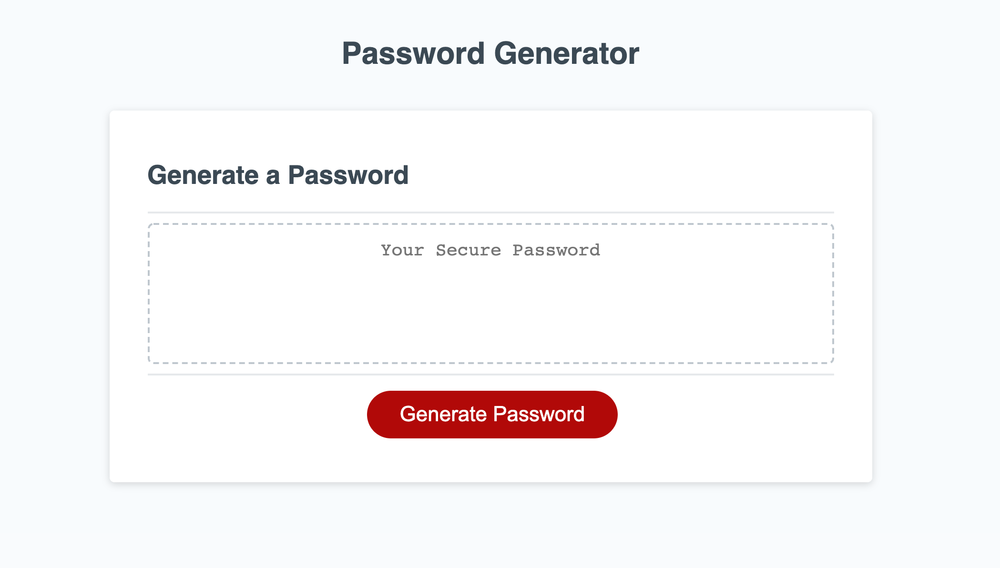

# Password Generator

## Week 3 homeowrk assignment is to create a password generator that meets the following critiera:

### -When the 'generate password' button is clicked the user is prompted with a series of questions.

### -Questions ask if the user would like the password to include lowercase, uppercase, numbers, and/or special characters.

### -Once the the answers all prompts then a password will be generated on the page.

# Link to Live URL

[CLICK HERE](https://brittnc.github.io/password/)

# Screen Shot of Deployed URL

## Project Contains index.html, script.js, css.